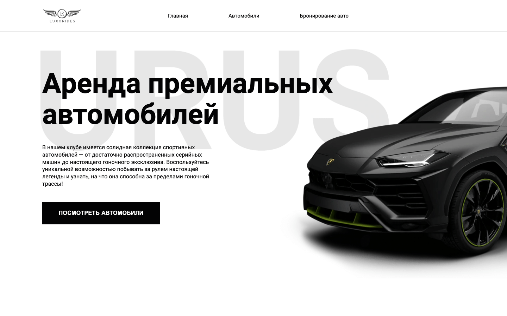
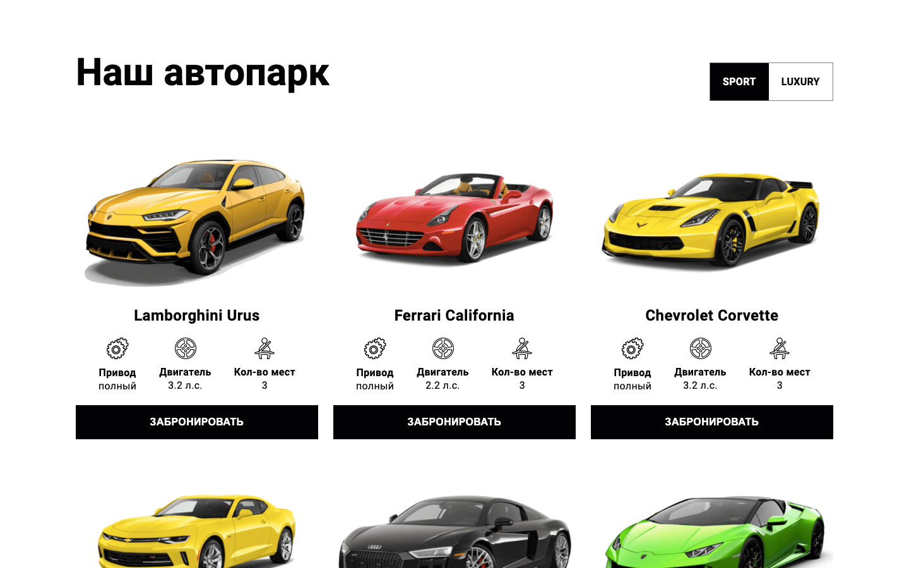
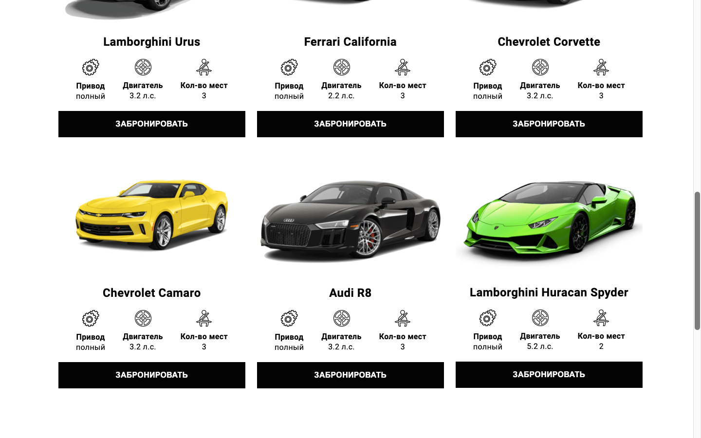
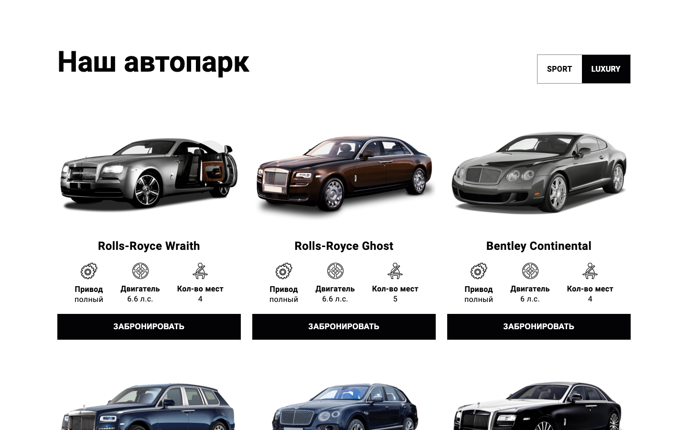
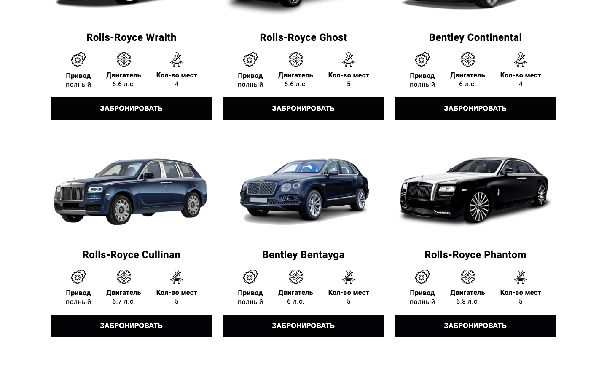
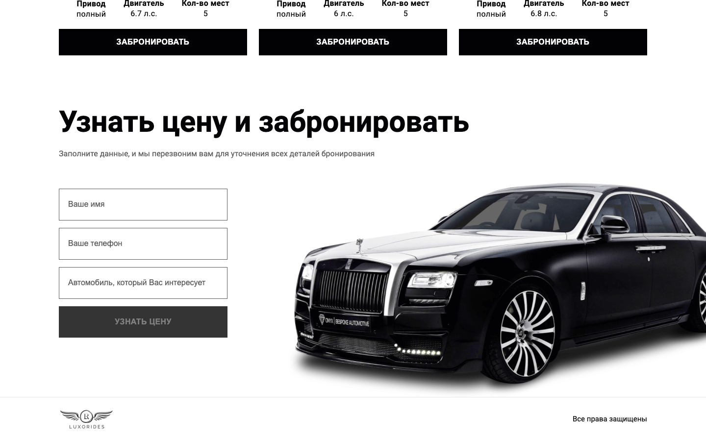
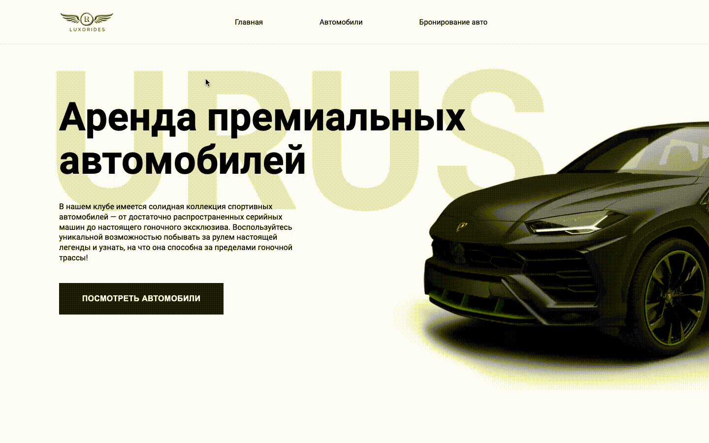

## Сайт LUXORIDES для аренды премиальных автомобилей.

Этот сайт был разработан мной в рамках семидневного интенсива по вёрстке. Основой для данного проекта послужил фреймворк Angular. Вёрства написана по макету из Figma ([ссылка на макет](https://www.figma.com/file/Ti6JoXstsk9S9gA4WTBExj/frontend-intensive?type=design&node-id=1-6&t=ULtz46TWpzbuCcTV-0)).

В программу интенсива входили домашние задания и установленные дедлайны на их выполнение. Во время выполнения ДЗ, я проявлял свою творческую сторону.

По итогу прохождения программы, я получил ценные навыки верстки и опыт взаимодействия с фреймворком Angular и языком TypeScript.

---

- Скриншоты интерфейса сайта:













- Скринкасты взаимодействия с элементами сайта:




---

> В моём личном блоге есть [_**пост**_](https://t.me/morozov_code/63) об этом проекте.

> Открыть сайт можно по ссылке: [morozovcode.github.io/Cars-app](https://morozovcode.github.io/Cars-app/)

> Запустить проект у себя, можно введя следующие команды в терминале:

```
$ git clone https://github.com/MOROZOVcode/Cars-app.git
$ cd Cars-app
$ npm instal
```
